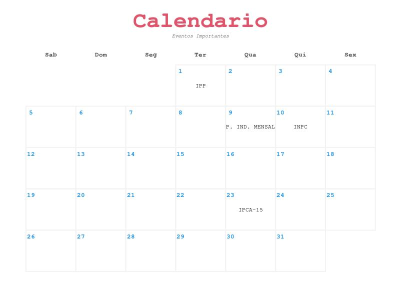
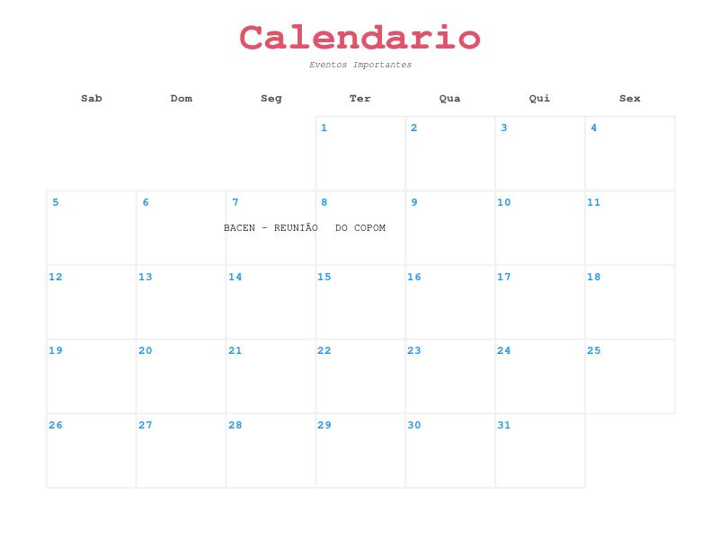
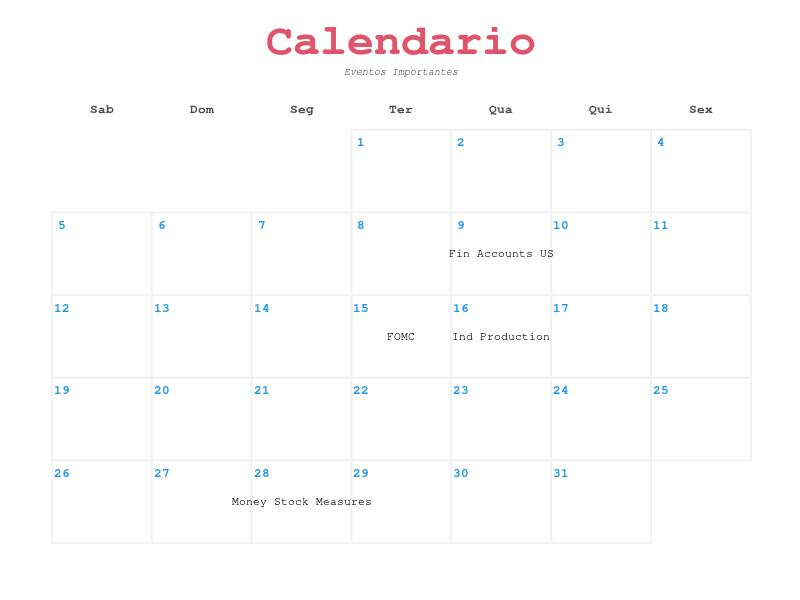

`r knitr::opts_chunk$set(echo = FALSE, warning = FALSE, message = FALSE, cache = F)`

```{css, echo=FALSE}
.fluid-row {
  font-size: 5.9vw;
}
```

```{r setup, include=FALSE}
# Libraries ---------------------------------------------------------------
pacman::p_load(ggplot2, tidyr, readxl ,dplyr, forcats, fitdistrplus,lubridate,
               tseries, forecast, timetk, zoo,wktmo, plotly,magrittr,
               widgetframe, data.table, webshot, htmlwidgets,stringr,
               formattable, calendR, flexdashboard, BETS)


options(scipen=999)
setwd('/media/arduin/Ubuntu HDD/01. GECE/01. Monetaria')


```


IPCA
===================================== 

Row {}
-------------------------------------

### Calendario de Dezembro
```{r, echo=FALSE, results='hide'}
## Calendar
jpeg(file="02. Images/calendarIPCA.jpeg", width = 800, height = 600)
calendR(year = 2021,                      # Year
        month = 12,                       # Month
        start = "S",                      # Start of the week ("S": Sunday, "M": Monday)
        title = "Calendario",            # Change the title
        title.size = 45,                  # Font size of the title
        title.col = 2,                    # Color of the title
        subtitle = "Eventos Importantes",    # Add a subtitle
        weeknames = c("Dom", "Seg", "Ter", "Qua", # Change week day names
                      "Qui", "Sex", "Sab"), 
        text = c("IPP","P. IND. MENSAL","INPC","IPCA-15"),
        text.pos = c(1,9,10,23),
        special.days = c(),
        special.col = "#bfe2f2",
        text.col = 1,
        low.col = "white",
        col = "#f2f2f2",                  # Color of the lines of the calendar
        lwd = 1,                          # Width of the lines of the calendar
        lty = 1,                          # Line type of the lines of the calendar
        font.family = "mono",             # Font family of all the texts                 
        font.style = "bold",              # Font style of the texts except the subtitle
        weeknames.col = "gray30",          # Color of the names of the days of the week
        months.col = "gray30",             # If month = NULL, is the color of the month names
        days.col = 4,                     # Color of the number of the days
        day.size = 4.5,                   # Size of the number of days
        bg.img = "")
dev.off()
```

<div style="width:300px; height:200px">

</div>

### Série Completa de Inflação
```{r, echo=FALSE, error=TRUE, fig.height=8, message=FALSE, warning=FALSE}
# Table
ipca_ts_anlDf <- read.csv("01. bases/ipcaDataFrame.csv")[,2:3]
ipca_ts_anlDf_table <- ipca_ts_anlDf 

ipca_ts_anlDf_table = ipca_ts_anlDf_table %>% `rownames<-`(NULL)
names(ipca_ts_anlDf_table) <- c("Data", "IPCA Mensal")
DT::datatable(ipca_ts_anlDf_table, 
              options = list(searching = T, pageLength = 10,
                             lengthMenu = c(5, 10, 15),
                             scrollY = "350px", columnDefs = list(list(visible=FALSE))))


```

Column {.tabset}
-------------------------------------
   
### Série Temporal

```{r, attr.output='style="max-height: 100px;"'}
## Data
ipca <- read.csv("01. bases/ipcaTS.csv")
ipca_df <- read.csv("01. bases/ipcaDataFrame.csv")


# Cleaning Data
IPCATS <- ts(ipca$x, start = c(1980,1),  frequency = 12)
ipca_ts <- window(IPCATS, start = c(1980,1))
ipca_ts_anl <- ipca_ts[373:501]
ipca_ts_anlDf <- ipca_df[373:501,]
ipca_ts_anlDf$mes <- month(ipca_ts_anlDf$date)

ggtsdisplay(ipca_ts_anl, points = T, main = "IPCA Mensal 2011 - 2021")
```   
 
### Boxplot
    
```{r}
plot_ly(ipca_ts_anlDf,y=~value,x=~mes,color=~mes,type="box") %>% layout(showlegend = FALSE)

```

### Modelo Arima
    
```{r}
# Adjusting Arima
ipca_ts_anl_training <- ts(ipca_ts_anl[1:127])
ipca_ts_anl_testing <- ts(ipca_ts_anl[128:129])
fit <- Arima(y = ipca_ts_anl_training, order = c(1,0,0), seasonal = c(0,0,0), lambda = T)

# Final Plot
fcast <- forecast(fit, h=2)
ipca_ts_anlDf$Pred <- c(fit$fitted,fcast$mean)

ipca_ts_anlDf$ID <- 1:length(ipca_ts_anlDf$value)

ipca_ts_anlDf <- ipca_ts_anlDf %>% mutate(
  RA3 = slidify_vec(
    .x      = value,
    .period = 3,
    .f      = mean,
    na.rm   = TRUE,
    .align  = "center",
    .partial = TRUE),
  RA5 = slidify_vec(
    .x      = value,
    .period = 30,
    .f      = mean,
    na.rm   = TRUE,
    .align  = "center",
    .partial = TRUE))


fig <- plot_ly(ipca_ts_anlDf, x = ~ID)
fig <- fig %>% add_trace(y = ~value, name = 'Valores',mode = 'lines')
fig <- fig %>% add_trace(y = ~RA3, name = 'Rolling Average 3 Months', mode = 'lines')
fig <- fig %>% add_trace(y = ~RA5, name = 'Rolling Average 5 Months', mode = 'lines')
fig <- fig %>% add_trace(y = ~Pred, name = 'Predict Value', mode = 'lines+markers')

fig %>%
  layout(legend = list(orientation = "v",   # show entries horizontally
                       xanchor = "right",  # use center of legend as anchor
                       x = 1))             # put legend in center of x-axis

```


CDI
===================================== 

Row {}
-------------------------------------
### Calendario de Dezembro
```{r, echo=FALSE, results='hide'}
## Calendar
jpeg(file="02. Images/calendarCDI.jpeg", width = 800, height = 600)
calendR(year = 2021,                      # Year
        month = 12,                       # Month
        start = "S",                      # Start of the week ("S": Sunday, "M": Monday)
        title = "Calendario",            # Change the title
        title.size = 45,                  # Font size of the title
        title.col = 2,                    # Color of the title
        subtitle = "Eventos Importantes",    # Add a subtitle
        weeknames = c("Dom", "Seg", "Ter", "Qua", # Change week day names
                      "Qui", "Sex", "Sab"), 
        text = c("BACEN - REUNIÃO","DO COPOM"),
        text.pos = c(7,8),
        special.days = c(),
        special.col = "#bfe2f2",
        text.col = 1,
        low.col = "white",
        col = "#f2f2f2",                  # Color of the lines of the calendar
        lwd = 1,                          # Width of the lines of the calendar
        lty = 1,                          # Line type of the lines of the calendar
        font.family = "mono",             # Font family of all the texts                 
        font.style = "bold",              # Font style of the texts except the subtitle
        weeknames.col = "gray30",          # Color of the names of the days of the week
        months.col = "gray30",             # If month = NULL, is the color of the month names
        days.col = 4,                     # Color of the number of the days
        day.size = 4.5,                   # Size of the number of days
        bg.img = "")
dev.off()
```

<div style="width:300px; height:200px">

</div>


### Série Completa de CDI
```{r, echo=FALSE, error=TRUE, fig.height=8, message=FALSE, warning=FALSE}
cdi_ts_anlDf_table <- read.csv("/media/arduin/Ubuntu HDD/01. GECE/01. Monetaria/01. bases/CDIDataFrame.csv")[,3:4]


## Table
cdi_ts_anlDf_table = cdi_ts_anlDf_table %>% `rownames<-`(NULL)

names(cdi_ts_anlDf_table) <- c("Data", "CDI Mensal")
DT::datatable(cdi_ts_anlDf_table, 
              options = list(searching = T, pageLength = 10,
                             lengthMenu = c(5, 10, 15),
                             scrollY = "350px", columnDefs = list(list(visible=FALSE))))


```

Column {.tabset}
-------------------------------------
   
### Série Temporal

```{r, attr.output='style="max-height: 100px;"'}
## Importing & Adjusting Data
CDI_df <- read.csv("/media/arduin/Ubuntu HDD/01. GECE/01. Monetaria/01. bases/CDIDataFrame.csv")
CDI <- read.csv("/media/arduin/Ubuntu HDD/01. GECE/01. Monetaria/01. bases/CDITS.csv")


## Cleaning Data
CDITS <- ts(CDI$value, start = c(1986,3),  frequency = 12)
CDI_ts <- window(CDITS, start = c(1986,3))
CDI_ts_anl <- CDI_ts[301:429]
CDI_ts_anlDf <- CDI_df[301:429,]
CDI_ts_anlDf$mes <- month(CDI_ts_anlDf$date)

## Cleaning Data
CDI_df <- CDI_df[,-1] 
names(CDI_df) <- c("ID", "Date", "Value")
CDI_df$Mes <- month(CDI_df$Date)

## Análise Descritiva
ggtsdisplay(CDITS[301:429], points = T, main = "CDI Mensal 2011 - 2021")
```   
 
### Boxplot
    
```{r}
### Boxplot
plot_ly(CDI_ts_anlDf,y=~value,x=~mes,color=~mes,type="box") %>% layout(showlegend = FALSE)


```

### Modelo Arima
    
```{r}
### Adjusting Arima
CDI_ts_anl_training <- ts(CDI_ts_anl[1:127])
CDI_ts_anl_testing <- ts(CDI_ts_anl[128:129])
fit <- Arima(y = CDI_ts_anl_training, order = c(1,0,0), seasonal = c(0,0,0), lambda = T)

### Final Plot
fcast <- forecast(fit, h=2)
CDI_ts_anlDf$Pred <- c(fit$fitted,fcast$mean)

CDI_ts_anlDf$ID <- 1:length(CDI_ts_anlDf$value)

CDI_ts_anlDf <- CDI_ts_anlDf %>% mutate(
  RA3 = slidify_vec(
    .x      = value,
    .period = 3,
    .f      = mean,
    na.rm   = TRUE,
    .align  = "center",
    .partial = TRUE),
  RA5 = slidify_vec(
    .x      = value,
    .period = 30,
    .f      = mean,
    na.rm   = TRUE,
    .align  = "center",
    .partial = TRUE))


fig <- plot_ly(CDI_ts_anlDf, x = ~ID)
fig <- fig %>% add_trace(y = ~value, name = 'Valores',mode = 'lines')
fig <- fig %>% add_trace(y = ~RA3, name = 'Rolling Average 3 Months', mode = 'lines')
fig <- fig %>% add_trace(y = ~RA5, name = 'Rolling Average 5 Months', mode = 'lines')
fig <- fig %>% add_trace(y = ~Pred, name = 'Predict Value', mode = 'lines+markers')

fig %>%
  layout(legend = list(orientation = "v",   # show entries horizontally
                       xanchor = "right",  # use center of legend as anchor
                       x = 1))             # put legend in center of x-axis

```

CAMBIO
===================================== 

Row {}
-------------------------------------
### Calendario de Dezembro
```{r, echo=FALSE, results='hide'}
## Calendar
jpeg(file="02. Images/calendarCAMBIO.jpeg", width = 800, height = 600)
calendR(year = 2021,                      # Year
        month = 12,                       # Month
        start = "S",                      # Start of the week ("S": Sunday, "M": Monday)
        title = "Calendario",            # Change the title
        title.size = 45,                  # Font size of the title
        title.col = 2,                    # Color of the title
        subtitle = "Eventos Importantes",    # Add a subtitle
        weeknames = c("Dom", "Seg", "Ter", "Qua", # Change week day names
                      "Qui", "Sex", "Sab"), 
        text = c("Fin Accounts US","FOMC","Ind Production","Money Stock Measures"),
        text.pos = c(9,15,16, 28),
        special.days = c(),
        special.col = "#bfe2f2",
        text.col = 1,
        low.col = "white",
        col = "#f2f2f2",                  # Color of the lines of the calendar
        lwd = 1,                          # Width of the lines of the calendar
        lty = 1,                          # Line type of the lines of the calendar
        font.family = "mono",             # Font family of all the texts                 
        font.style = "bold",              # Font style of the texts except the subtitle
        weeknames.col = "gray30",          # Color of the names of the days of the week
        months.col = "gray30",             # If month = NULL, is the color of the month names
        days.col = 4,                     # Color of the number of the days
        day.size = 4.5,                   # Size of the number of days
        bg.img = "")
dev.off()
```

<div style="width:300px; height:200px">

</div>


### Série Completa de Inflação
```{r, echo=FALSE, error=TRUE, fig.height=8, message=FALSE, warning=FALSE}
## Table
cambio_ts_anlDf_table <- read.csv("/media/arduin/Ubuntu HDD/01. GECE/01. Monetaria/01. bases/taxaCambioDataFrame.csv")[,2:3]

cambio_ts_anlDf_table = cambio_ts_anlDf_table %>% `rownames<-`(NULL)
names(cambio_ts_anlDf_table) <- c("Data", "Cambio Mensal")
DT::datatable(cambio_ts_anlDf_table, 
              options = list(searching = T, pageLength = 10,
                             lengthMenu = c(5, 10, 15),
                             scrollY = "350px", columnDefs = list(list(visible=FALSE))))

```

Column {.tabset}
-------------------------------------
   
### Série Temporal

```{r, attr.output='style="max-height: 100px;"'}
## Importing & Adjusting Data
taxaCambio_df <- read.csv("/media/arduin/Ubuntu HDD/01. GECE/01. Monetaria/01. bases/taxaCambioDataFrame.csv")
taxaCambio <- read.csv("/media/arduin/Ubuntu HDD/01. GECE/01. Monetaria/01. bases/taxaCambioTS.csv")


## Data
## Cleaning Data
taxaCambioTS <- ts(taxaCambio$value, start = c(1986,6),  frequency = 12)
taxaCambio_ts <- window(taxaCambioTS, start = c(1986,6))
taxaCambio_ts_anl <- taxaCambio_ts[374:502]
taxaCambio_ts_anlDf <- taxaCambio_df[374:502,]
taxaCambio_ts_anlDf$mes <- month(taxaCambio_ts_anlDf$date)


## Cleaning Data
names(taxaCambio_df) <- c("ID", "Date", "Value")
taxaCambio_df$Mes <- month(taxaCambio_df$Date)

## Análise Descritiva
ggtsdisplay(taxaCambioTS[374:502], points = T, main = "Taxa Cambio Mensal 2011 - 2021")
```   
 
### Boxplot
    
```{r}
### Boxplot
plot_ly(taxaCambio_ts_anlDf,y=~value,x=~mes,color=~mes,type="box") %>% layout(showlegend = FALSE)
```

### Modelo Arima
    
```{r}
### Adjusting Arima
taxaCambio_ts_anl_training <- ts(taxaCambio_ts_anl[1:127])
taxaCambio_ts_anl_testing <- ts(taxaCambio_ts_anl[128:129])
fit <- Arima(y = taxaCambio_ts_anl_training, order = c(1,0,0), seasonal = c(0,0,0), lambda = T)

### Final Plot
fcast <- forecast(fit, h=2)
taxaCambio_ts_anlDf$Pred <- c(fit$fitted,fcast$mean)

taxaCambio_ts_anlDf$ID <- 1:length(taxaCambio_ts_anlDf$value)

taxaCambio_ts_anlDf <- taxaCambio_ts_anlDf %>% mutate(
  RA3 = slidify_vec(
    .x      = value,
    .period = 3,
    .f      = mean,
    na.rm   = TRUE,
    .align  = "center",
    .partial = TRUE),
  RA5 = slidify_vec(
    .x      = value,
    .period = 30,
    .f      = mean,
    na.rm   = TRUE,
    .align  = "center",
    .partial = TRUE))


fig <- plot_ly(taxaCambio_ts_anlDf, x = ~ID)
fig <- fig %>% add_trace(y = ~value, name = 'Valores',mode = 'lines')
fig <- fig %>% add_trace(y = ~RA3, name = 'Rolling Average 3 Months', mode = 'lines')
fig <- fig %>% add_trace(y = ~RA5, name = 'Rolling Average 5 Months', mode = 'lines')
fig <- fig %>% add_trace(y = ~Pred, name = 'Predict Value', mode = 'lines+markers')

fig %>%
  layout(legend = list(orientation = "v",   # show entries horizontally
                       xanchor = "right",  # use center of legend as anchor
                       x = 1))             # put legend in center of x-axis


```

SELIC
===================================== 

Row {}
-------------------------------------

### Calendario de Dezembro
```{r, echo=FALSE, results='hide'}
## Calendar
jpeg(file="02. Images/calendarSELIC.jpeg", width = 800, height = 600)
calendR(year = 2021,                      # Year
        month = 12,                       # Month
        start = "S",                      # Start of the week ("S": Sunday, "M": Monday)
        title = "Calendario",            # Change the title
        title.size = 45,                  # Font size of the title
        title.col = 2,                    # Color of the title
        subtitle = "Eventos Importantes",    # Add a subtitle
        weeknames = c("Dom", "Seg", "Ter", "Qua", # Change week day names
                      "Qui", "Sex", "Sab"), 
        text = c("BACEN - REUNIÃO","DO COPOM"),
        text.pos = c(7,8),
        special.days = c(),
        special.col = "#bfe2f2",
        text.col = 1,
        low.col = "white",
        col = "#f2f2f2",                  # Color of the lines of the calendar
        lwd = 1,                          # Width of the lines of the calendar
        lty = 1,                          # Line type of the lines of the calendar
        font.family = "mono",             # Font family of all the texts                 
        font.style = "bold",              # Font style of the texts except the subtitle
        weeknames.col = "gray30",          # Color of the names of the days of the week
        months.col = "gray30",             # If month = NULL, is the color of the month names
        days.col = 4,                     # Color of the number of the days
        day.size = 4.5,                   # Size of the number of days
        bg.img = "")
dev.off()
```

<div style="width:300px; height:200px">

</div>

### Série Completa de SELIC
```{r, echo=FALSE, error=TRUE, fig.height=8, message=FALSE, warning=FALSE}
## Importing & Adjusting Data
SELIC_df <- read.csv("/media/arduin/Ubuntu HDD/01. GECE/01. Monetaria/01. bases/selicDataFrame.csv")
SELIC <- read.csv("/media/arduin/Ubuntu HDD/01. GECE/01. Monetaria/01. bases/selicTS.csv")

## Table
selic_ts_anlDf_table <- read.csv("/media/arduin/Ubuntu HDD/01. GECE/01. Monetaria/01. bases/selicDataFrame.csv")[,2:3]

selic_ts_anlDf_table = selic_ts_anlDf_table %>% `rownames<-`(NULL)
names(selic_ts_anlDf_table) <- c("Data", "SELIC Mensal")
DT::datatable(selic_ts_anlDf_table, 
              options = list(searching = T, pageLength = 10,
                             lengthMenu = c(5, 10, 15),
                             scrollY = "350px", columnDefs = list(list(visible=FALSE))))


```

Column {.tabset}
-------------------------------------
   
### Série Temporal

```{r, attr.output='style="max-height: 100px;"'}

## Data
## Cleaning Data
SELICTS <- ts(SELIC$value, start = c(1986,6),  frequency = 12)
SELIC_ts <- window(SELICTS, start = c(1986,6))
SELIC_ts_anl <- SELIC_ts[298:426]
SELIC_ts_anlDf <- SELIC_df[298:426,]
SELIC_ts_anlDf$mes <- month(SELIC_ts_anlDf$date)

## Cleaning Data
names(SELIC_df) <- c("ID", "Date", "Value")
SELIC_df$Mes <- month(SELIC_df$Date)

## Análise Descritiva
ggtsdisplay(SELICTS, points = T, main = "SELIC Mensal 1990 - 2021")

```   
 
### Boxplot
    
```{r}
### Boxplot
plot_ly(SELIC_ts_anlDf,y=~value,x=~mes,color=~mes,type="box") %>% layout(showlegend = FALSE)

```

### Modelo Arima
    
```{r}

### Adjusting Arima
SELIC_ts_anl_training <- ts(SELIC_ts_anl[1:127])
SELIC_ts_anl_testing <- ts(SELIC_ts_anl[128:129])
fit <- Arima(y = SELIC_ts_anl_training, order = c(1,0,0), seasonal = c(0,0,0), lambda = T)

### Final Plot
fcast <- forecast(fit, h=2)
SELIC_ts_anlDf$Pred <- c(fit$fitted,fcast$mean)

SELIC_ts_anlDf$ID <- 1:length(SELIC_ts_anlDf$value)

SELIC_ts_anlDf <- SELIC_ts_anlDf %>% mutate(
  RA3 = slidify_vec(
    .x      = value,
    .period = 3,
    .f      = mean,
    na.rm   = TRUE,
    .align  = "center",
    .partial = TRUE),
  RA5 = slidify_vec(
    .x      = value,
    .period = 30,
    .f      = mean,
    na.rm   = TRUE,
    .align  = "center",
    .partial = TRUE))


fig <- plot_ly(SELIC_ts_anlDf, x = ~ID)
fig <- fig %>% add_trace(y = ~value, name = 'Valores',mode = 'lines')
fig <- fig %>% add_trace(y = ~RA3, name = 'Rolling Average 3 Months', mode = 'lines')
fig <- fig %>% add_trace(y = ~RA5, name = 'Rolling Average 5 Months', mode = 'lines')
fig <- fig %>% add_trace(y = ~Pred, name = 'Predict Value', mode = 'lines+markers')

fig %>%
  layout(legend = list(orientation = "v",   # show entries horizontally
                       xanchor = "right",  # use center of legend as anchor
                       x = 1))             # put legend in center of x-axis


```
